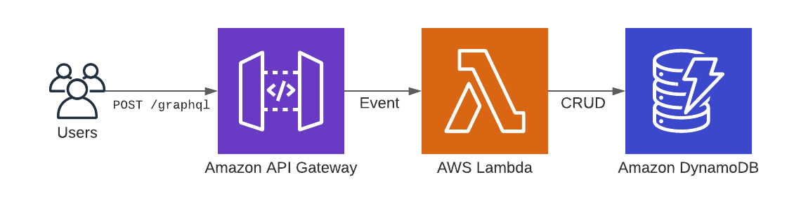
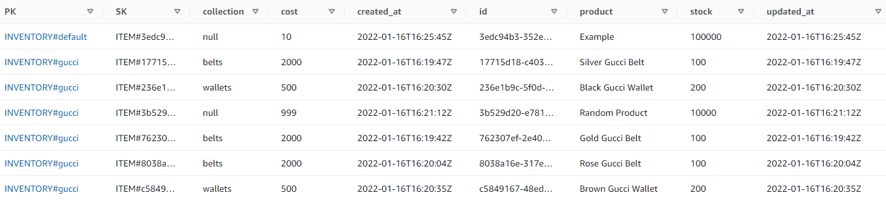

# Backend Developer Intern Challenge


## TLDR

- Requirements: [Shopify Backend Developer Intern Challenge - Summer 2022](https://docs.google.com/document/d/1z9LZ_kZBUbg-O2MhZVVSqTmvDko5IJWHtuFmIu_Xg1A/edit)
- Extra feature chosen: *"Ability to assign/remove inventory items to a named group/collection"*.
- Open [shopify.holmes-dev.com](https://shopify.holmes-dev.com) to use the application. **No setup is required**.

## About

The application is a GraphQL API that allows users to create, read, update, and delete inventory items. The extra feature I chose to implement was the *"ability to assign/remove inventory items to a named group/collection"*. 

The application is deployed on Amazon Web Services (AWS) using a serverless architecture with API-Gateway, Lambda, and DynamoDB. 

## Application 

The application is a GraphQL API writen in Python using [FastAPI](https://fastapi.tiangolo.com/) and [Ariadne](https://ariadnegraphql.org/). GraphQL is my favourite way to build APIs. I read the [Shopify GraphQL Design Tutorial](https://github.com/Shopify/graphql-design-tutorial/blob/master/TUTORIAL.md) when I learned GraphQL and I've kept it in mind especially when designing this API.

**Design**

- The `Item.collection` field is nullable. If the collection is `null` that means the item does not belong to a collection. Therefore the `itemUpdateCollection` mutation and `itemsByCollection` query allow the collection to be null as well.
- The `Item` has a `product` field which is a string. In the future I think this would be a `Product` type with fields like description, name, and price.
- There are three mutations for updating items: `itemUpdate`, `itemUpdateCollection` and `itemUpdateStock`. The `itemUpdate` mutation is a general update and can be used to update any field. The `itemUpdateCollection` and `itemUpdateStock` were added for convenience.
- I decided not to implement pagination for the `items` and `itemsByCollection` queries.

**GraphQL Schema**

[schema.graphql](/schema.graphql)

```graphql
scalar DateTime # YYYY-MM-DDTHH:MM:SSZ

type Item {
    id: ID!
    product: String!        
    cost: Float!            # unit cost
    stock: Int!             # units available
    collection: String
    createdAt: DateTime!
    updatedAt: DateTime!
}

type ItemPayload {
    error: String
    item: Item
}

input ItemInput {
    product: String!
    cost: Float!
    stock: Int!
    collection: String
}

type Mutation {
    itemCreate(input: ItemInput!): ItemPayload!
    itemUpdate(id: ID!, input: ItemInput!): ItemPayload!
    itemUpdateCollection(id: ID!, collection: String): ItemPayload!
    itemUpdateStock(id: ID!, change: Int!): ItemPayload!
    itemDelete(id: ID!): ItemPayload!
}

type Query {
    item(id: ID!): Item 
    items: [Item!]!
    itemsByCollection(collection: String): [Item!]!
}
```

## Amazon Web Services

The application is deployed using an entirely servless architecture on AWS with [API-Gateway](https://aws.amazon.com/api-gateway/), [Lambda](https://aws.amazon.com/lambda/), and [DynamoDB](https://aws.amazon.com/dynamodb/).



*"Amazon DynamoDB is a fully managed, serverless, key-value NoSQL database designed to run high-performance applications at any scale"*. The data is stored on DynamoDB with the following data model:


