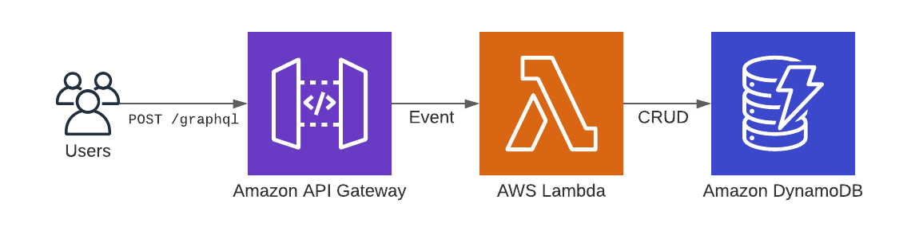
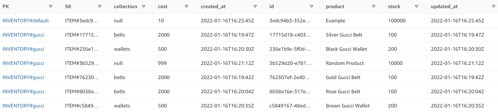

# Backend Developer Intern Challenge


## TLDR

- Requirements: [Shopify Backend Developer Intern Challenge - Summer 2022](https://docs.google.com/document/d/1z9LZ_kZBUbg-O2MhZVVSqTmvDko5IJWHtuFmIu_Xg1A/edit)
- Extra feature chosen: *Ability to assign/remove inventory items to a named group/collection*
- The application is deployed to AWS: 

## How to run/access the application

### Option #1: Access the deployed version on Amazon Web Services

The application is deployed to [shopify.holmes-dev.com](https://shopify.holmes-dev.com/graphql). If that URL doesn't for any reason the endpoint can be accessed directly without the custom domain [here](https://7d03f6hr17.execute-api.ca-central-1.amazonaws.com/graphql).

### Option #2: Run with Docker

```
docker build -f docker/Dockerfile -t shopify-challenge-image .
docker run -d --name shopify-challenge-container -p 8000:8000 shopify-challenge-image
```

### Option #3: Run with Python

1. Add a `.env` file to the root directory of the repository containing `CONTEXT=LOCAL`
2. Install dependencies from `requirements.txt` using `pip install -r requirements.txt`
3. Run the application `uvicorn main:app`

#### Environment Variables
The only environment variables that's necessary is `CONTEXT`. If using `CONTEXT=LOCAL` no other environemnt variables are necessary. 

CONTEXT=AWS_DEV|AWS_PROD|LOCAL

AWS_REGION_NAME=ca-central-1
AWS_ACCESS_KEY=XXXXXXXXXXXXXXXXXXXXXX
AWS_SECRET_ACCESS_KEY=XXXXXXXXXXXXXXXXXXXXX
AWS_DYNAMODB_TABLE=table-name
```

#### Testing
```
python -m pytest -v
python -m pytest --cov-report term-missing --cov=app.db app_tests/
```

## Amazon Web Services

The application is deployed using an entirely servless architecture on AWS with API-Gateway, Lambda, and DynamoDB.



The data is stored on DynamoDB with the following data model:


