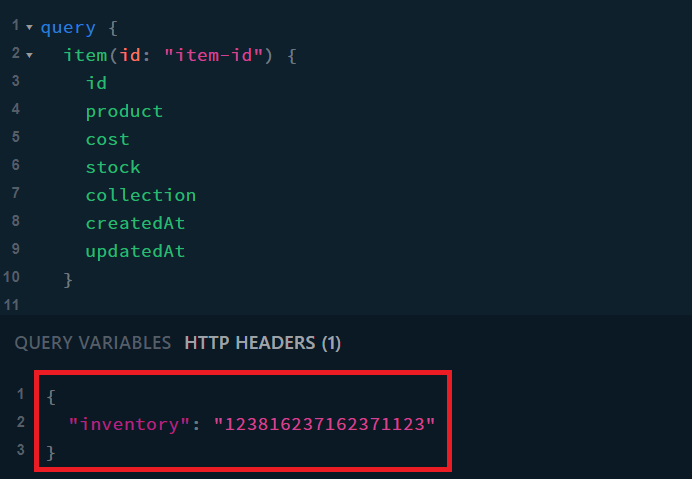

# How to use the application

- Open 
- If you're familiar with GraphQL it should be easy to use

## Headers

Add an `inventory` header to your request when using the GraphQL API. This will keep your inventory separate from other users. 

```json
{
    "inventory": "default"
}
```




## Examples

Create an item

```graphql
mutation {
  itemCreate(input: {
    product: "product-name",
    cost: 29.99,
    stock: 100000,
    collection: "collection-name"
  }) {
    error
    item {
      id
    }
  }
}
```

Read items

```graphql
query {
  item(id: "item-id") {
    id
    product
    cost
    stock
    collection
    createdAt
    updatedAt
  }
  
  itemsByCollection(collection: "collection-name") {
    id
    product
    collection
  }
  
  items {
    id
    product
    collection
  }
}
```

Update an item

```graphql
mutation {
  itemUpdateStock(id: "item-id", change: -50) {
    error
    item {
      id
      product
      stock
    }
  }
  
  itemUpdateCollection(id: "item-id", collection: "collection-name") {
    error
    item {
      id
      product
      collection
    }
  }
  
  itemUpdate(id: "item-id", input: {
    product: "new-product-name",
    cost: 39.99,
    stock: 50000,
    collection: "new-collection-name"
  }) {
    error
    item {
      id
      product
      cost
      stock
      collection
      createdAt
      updatedAt
    }
  }
}
```

Delete an item

```graphql
mutation {
  itemDelete(id: "item-id") {
    error
    item {
      id
    }
  }
}
```
